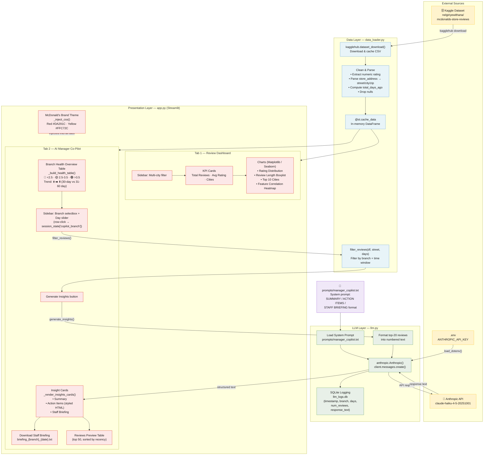

# Architecture Diagram — McDonald's Social Media Command Centre



## Component Summary

| Layer | File | Responsibility |
|---|---|---|
| **Data** | `app/data_loader.py` | Downloads dataset via kagglehub, cleans & parses, exposes `get_df()` and `filter_reviews()` |
| **LLM** | `app/llm.py` | Loads system prompt, formats reviews, calls Claude API, logs to SQLite |
| **Prompt** | `prompts/manager_copilot.txt` | Instructs Claude to output SUMMARY / ACTION ITEMS / STAFF BRIEFING |
| **Presentation** | `app/app.py` | Streamlit UI — two tabs, sidebar filters, charts, insight cards, briefing download |
| **Persistence** | `llm_logs.db` | SQLite — logs every LLM call (branch, days, num_reviews, response) |
| **Config** | `.env` | Holds `ANTHROPIC_API_KEY` (never committed) |

## Data Flow (Co-Pilot Tab)

```
Kaggle CSV
  └─► data_loader.get_df()          # clean + cache
        └─► filter_reviews()        # branch + time window
              └─► llm.generate_insights()
                    ├─► manager_copilot.txt  (system prompt)
                    ├─► top-20 reviews       (user message)
                    └─► Claude Haiku API
                          └─► SUMMARY / ACTION ITEMS / STAFF BRIEFING
                                ├─► Rendered as styled cards in Streamlit
                                ├─► Logged to llm_logs.db
                                └─► Downloadable as .txt briefing
```
